# Design Document 


Authors: Salem Mohamed Salem Metwaly Abouzaid, Patrizio de Girolamo, Giulia Medde, Carlo Vitale

Date: 19/05/2021

Version: 3


# Contents

- [High level design](#package-diagram)
- [Low level design](#class-diagram)
- [Verification traceability matrix](#verification-traceability-matrix)
- [Verification sequence diagrams](#verification-sequence-diagrams)

# Instructions

The design must satisfy the Official Requirements document, notably functional and non functional requirements

# High level design 
Architettural patterns: MVC, Facade

Package diagram  
======
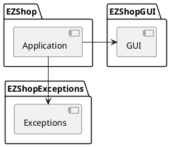

# Low level design
EZShop package:
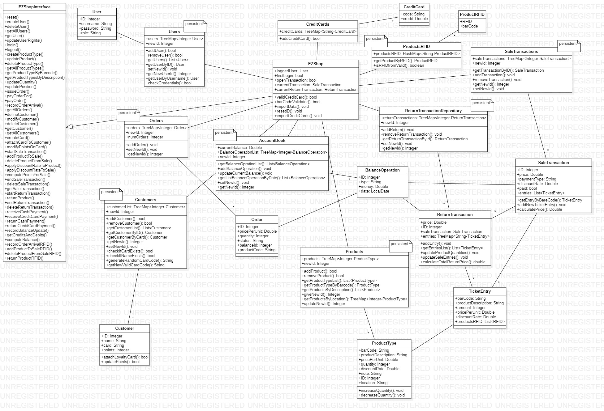


# Verification traceability matrix
||EZShop|ProductType|Position|Products|SaleTransaction|SaleTransactions|LoyaltyCard|Customer|Customers|ReturnTransaction|Order|Orders|User|Users|BalanceOperation|AccountBook|CreditCardCircuit|
|:----------:|:----------:|:----------:|:----------:|:----------:|:----------:|:----------:|:----------:|:----------:|:----------:|:----------:|:----------:|:----------:|:----------:|:----------:|:----------:|:----------:|:----------:|
| FR1 | X |  |  |  |  |  |  |  |  |  |  |  | X | X |  |  |  |
| FR3 | X | X | X | X |  |  |  |  |  |  |  | X | X |  |  |  |  |
| FR4 | X | X | X | X |  |  |  |  |  |  | X | X | X | X |  |  |  |
| FR5 | X |  |  |  |  |  | X | X | X |  |  |  | X | X |  |  |  |
| FR6 | X | X | X | X | X | X |  |  |  | X |  |  | X | X |  |  |  |
| FR7 | X |  |  |  |  |  |  |  |  |  |  |  | X | X |  |  | X |
| FR8 | X |  |  |  |  |  |  |  |  |  |  |  | X | X | X | X |  |

# Verification sequence diagrams 

Sequence diagram for each key scenario  

Scenario 1.1 - Create new product type
======
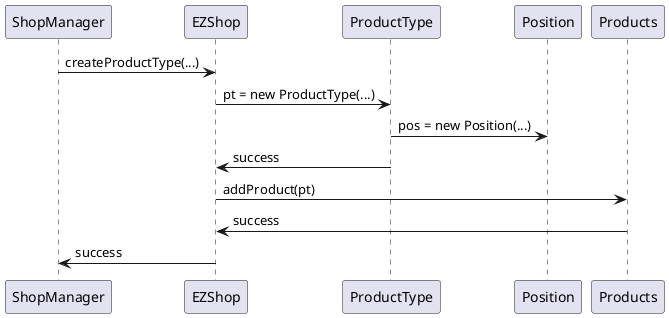
Scenario 2.1 - Create new user
======
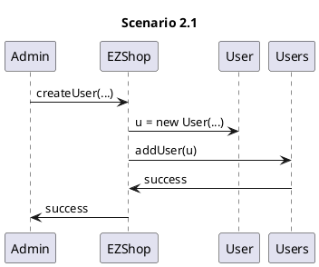
Scenario 3.1 - Order issued
======
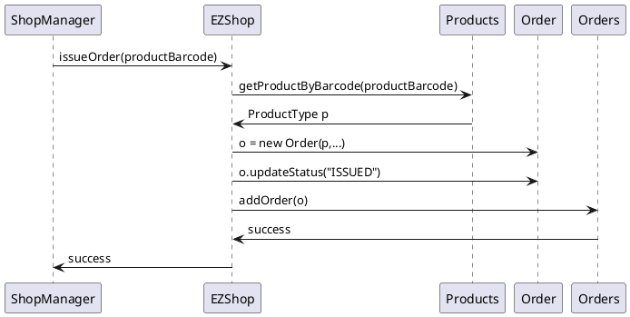
Scenario 3.2 - Order payed  
======  
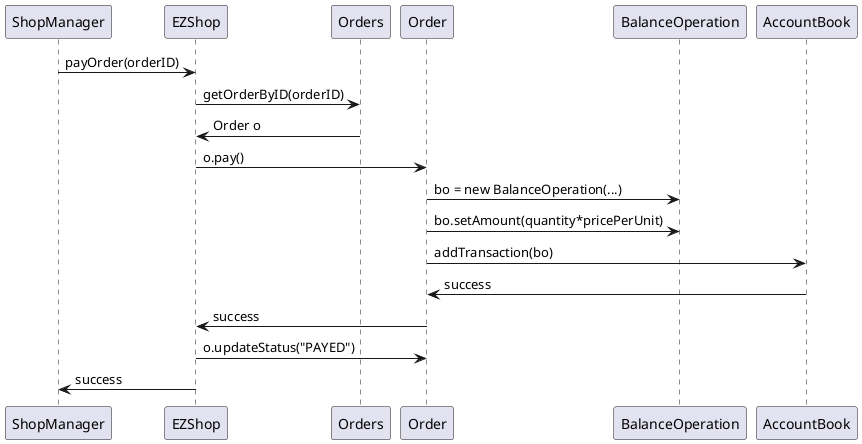
Scenario 3.3 - Order arrived  
======  
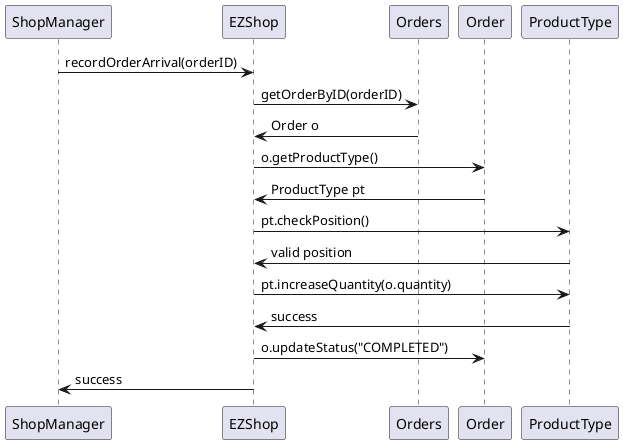
Scenario 4.1 - Create customer
===========
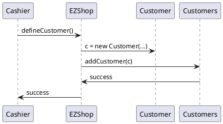

scenario 4.2 - Attach Loyalty Card to customer
====
```plantuml
Cashier -> EZShop :getCustomer(id)
EZShop -> Customers :getCustomerById(id)
Customers -> EZShop :customer c
EZShop -> Cashier :customer c
Cashier -> EZShop: attachCardToCustomer(cardCode,c.id)
EZShop -> Customer :attachLoyaltyCard(cardCode,c.id)
Customer -> LoyalityCard :new LoyaltyCard(cardCode)
Customer <- LoyalityCard :Loyalty.ID
EZShop <- Customer :Success
Cashier <- EZShop :Success
@enduml
```

Scenario 5.1 - Login
=======
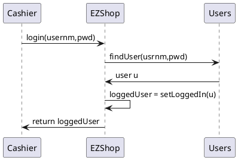

Scenario 5.2 - Logout
=======
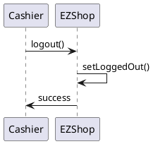

Scenario 6.4 - Sale of product type X with Loyalty Card update  
======  
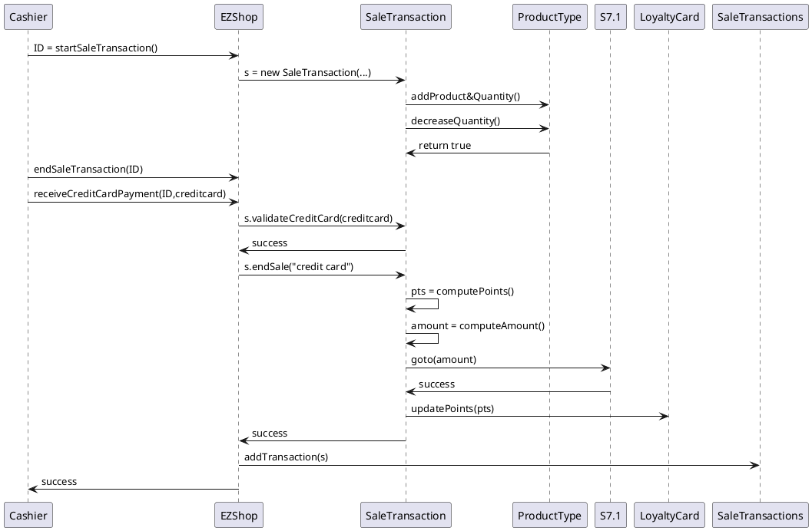

Scenario 6.5 - Sale of product type X cancelled  
======  
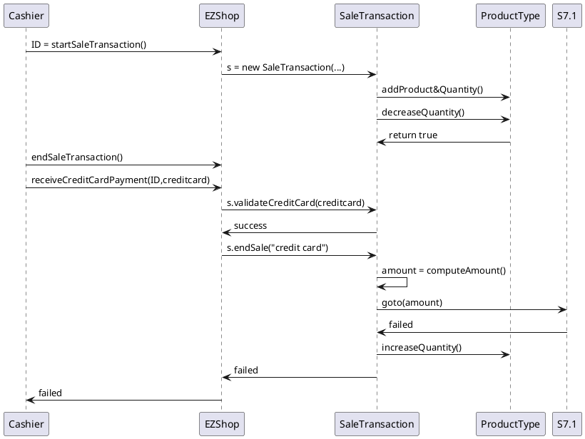

Scenario 6.6 - Sale of product type X completed(Cash)  
======  
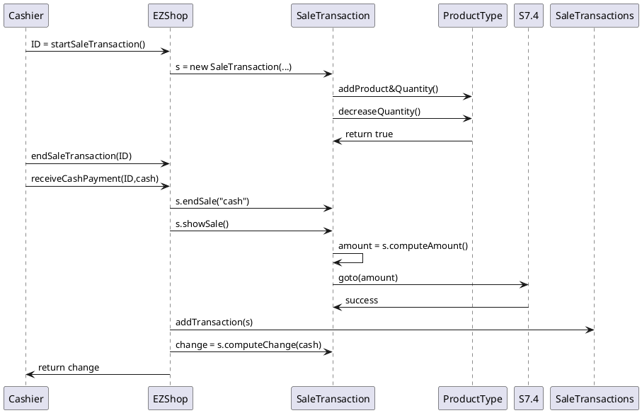

Scenario 7.1 - Manage payment by valid credit card 
======  
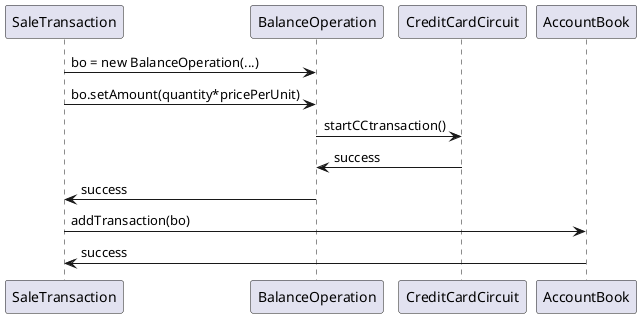
Scenario 7.4 - Manage cash payment 
======  
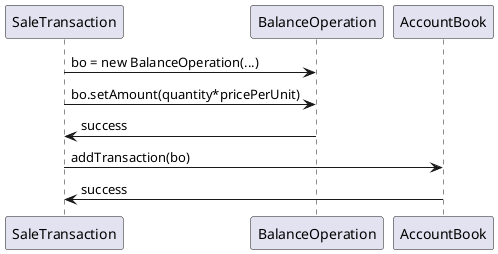

Scenario 8.1 - Return transaction of product type X completed, credit card
======  
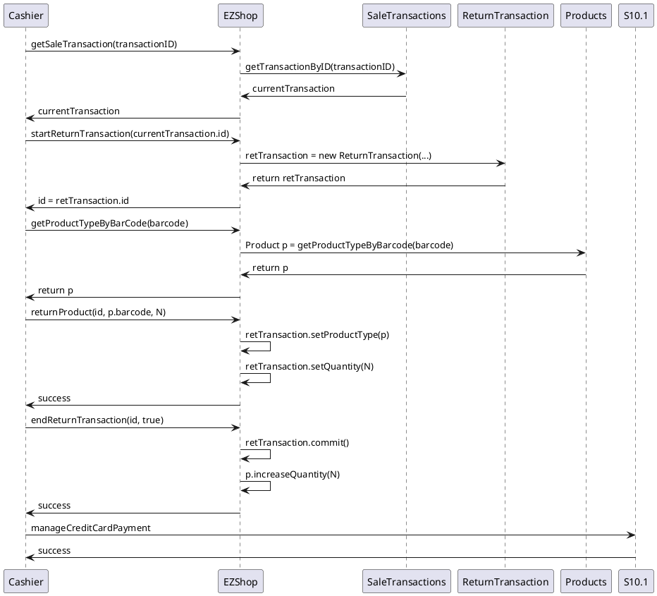

Scenario 8.2 - Return transaction of product type X completed, cash
======  
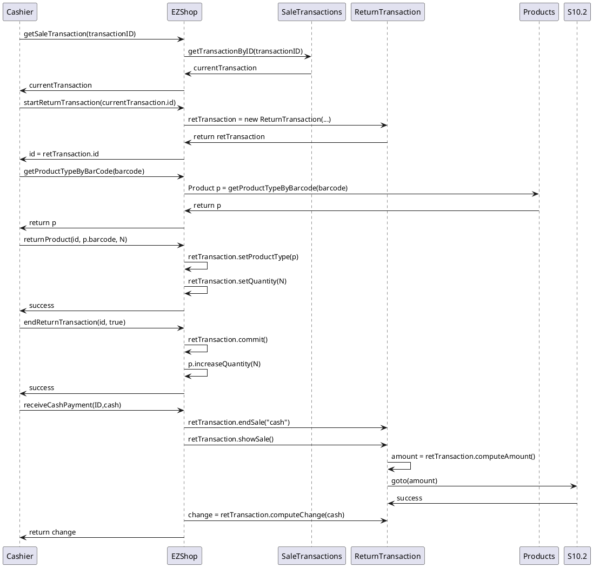

Scenario 9.1 - List credits and debits
======  
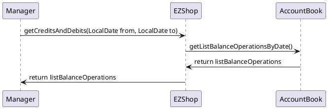
Scenario 10.1 - Return payment by  credit card
======  
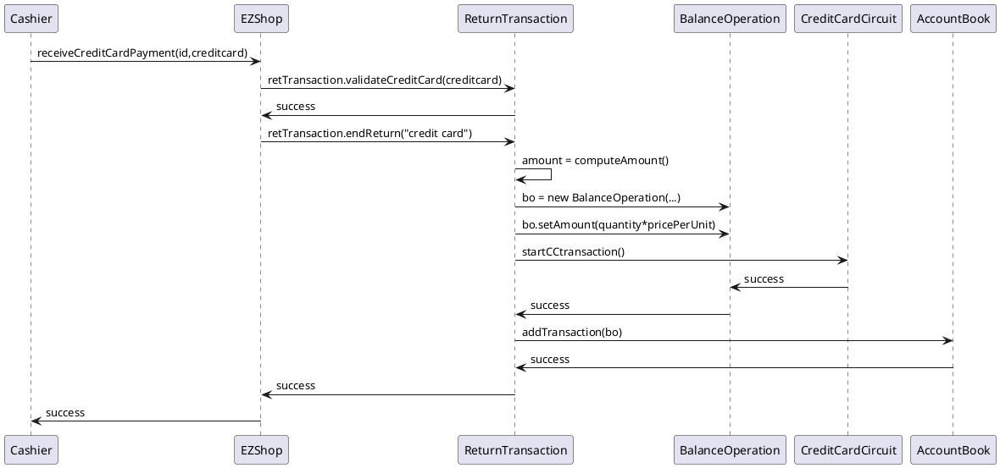
