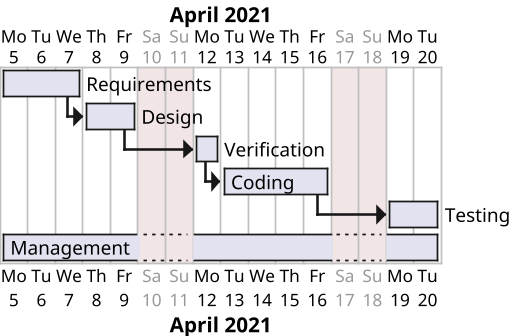

# Project Estimation  
Authors:
Date:
Version:
# Contents
- [Estimate by product decomposition]
- [Estimate by activity decomposition ]
# Estimation approach
<Consider the EZGas  project as described in YOUR requirement document, assume that you are going to develop the project INDEPENDENT of the deadlines of the course>
# Estimate by product decomposition
### 
|             | Estimate                        |             
| ----------- | ------------------------------- |  
| NC =  Estimated number of classes to be developed   |             17                |             
|  A = Estimated average size per class, in LOC       |              200              | 
| S = Estimated size of project, in LOC (= NC * A) | 3400 |
| E = Estimated effort, in person hours (here use productivity 10 LOC per person hour)  |               340                   |   
| C = Estimated cost, in euro (here use 1 person hour cost = 30 euro) | 10200 | 
| Estimated calendar time, in calendar weeks (Assume team of 4 people, 8 hours per day, 5 days per week ) |   2  |

# Estimate by activity decomposition
### 
|         Activity name    | Estimated effort (person hours)   |             
| ----------- | ------------------------------- | 
| Requirements (GUI prototype) | 70 TOT |
| Design | 40 |
| Verification| 20 |
| Coding| 120 |
| Testing| 60 |
| Management| 30|
###
## Gantt chart

