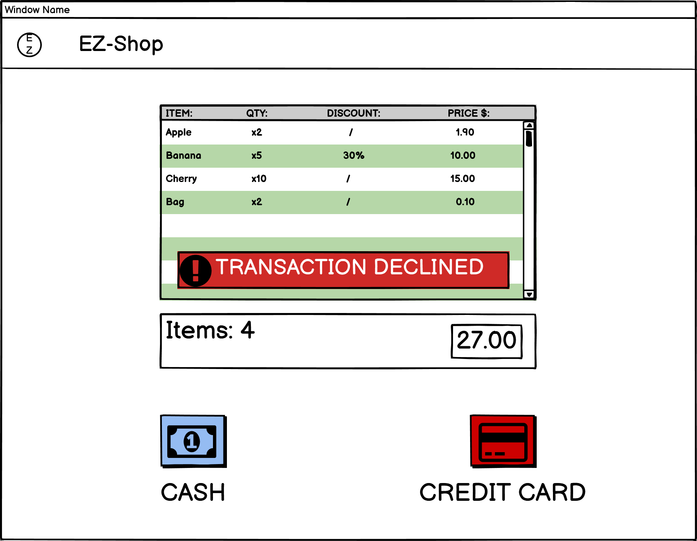

<link rel="stylesheet" type="text/css" href="prova.css" />

# Graphical User Interface Prototype  

Authors: Salem Mohamed Salem Metwaly Abouzaid, Patrizio de Girolamo, Giulia Medde, Carlo Vitale

Date: 21/04/2021

Version: 1

**SALE OF PRODUCTS**
=======
START NEW SALE(UC1 SCENARIOS:1-2-3-4-5)  
  
SCAN FIDELITY CARD(UC1 SCENARIOS:1-3-5)  
  
3 PRODUCTS SCANNED(UC1 SCENARIOS:1-2-3-4-5)  
  
ADD PRODUCT BY CODE(UC1 SCENARIOS:1-2-3-4-5)  
  
HOW MANY PRODUCTS TO ADD(UC1 SCENARIOS:1-2-3-4-5)  
  
UPDATED LIST AFTER 10 CHERRIES(UC1 SCENARIOS:1-2-3-4-5)  
  
REMOVE PRODUCT(UC1 SCENARIOS:1-2-3-4-5)  
  
PRODUCT REMOVED(UC1 SCENARIOS:1-2-3-4-5)  
  
ADD SHOPPING 2 BAGS(UC1 SCENARIOS:1-2-3-4-5)  
  
UPDATED LIST AFTER 2 BAGS(UC1 SCENARIOS:1-2-3-4-5)  
  
START PAYMENT(UC1 SCENARIOS:1-2-3-4-5)  
  
INSERT MONEY BELOW(UC1 SCENARIOS:3-4-5)  
  
TRANSACTION COMPLETED(UC1 SCENARIOS:3-4)  
  
PRINT RECEIPT AND KEEP CHANGE(UC1 SCENARIOS:3-4)  
  
TRANSACTION DECLINED(UC1 SCENARIOS:5)  
  
INSERT CREDIT CARD(UC1 SCENARIOS:1-2-5)  
  
PROCESSING PAYMENT(UC1 SCENARIOS:1-2-5)  
  
TRANSACTION COMPLETED(UC1 SCENARIOS:1-2)  
  
PRINT THE RECEIPT(UC1 SCENARIOS:1-2)  
  
TRANSACTION DECLINED(UC1 SCENARIO:5)  
  
CASHIER AUTHENTICATION(UC7 SCENARIO:2)  
  
CREATE NEW FIDELITY CARD(UC3 SCENARIO:1)  
  
=======
**STAFF AUTHENTICATION**
=======
STAFF LOGIN(UC7 SCENARIO:2)  
  
MANAGER HOME(UC7 SCENARIO:2)  
  
MANAGE EMPLOYEES(UC7)   
  
CHECK PERSONAL DATA(UC7)  
  
ADD NEW EMPLOYEE(UC7 SCENARIO:1)  
  
REMOVE EMPLOYEE(UC7 SCENARIO:2)   
  
MANAGE SUPPLIERS(UC6)  
  
SUPPLIER PRODUCTS(UC6)  
  
ADD NEW PRODUCT TO SUPPLIER 1(UC6)  
  
REMOVE PRODUCT FROM SUPPLIER 1(UC6)  
  
ADD NEW SUPPLIER(UC6 SCENARIO:1)  
  
REMOVE SUPPLIER(UC6 SCENARIO:2)   
  
LEDGER(UC4)  
  
SHOW ORDER 3 FROM SUPPLIER 3(UC4)  
    
INVENTORY(UC2)  
  
ADD LIST OF PRODUCTS TO INVENTORY(UC2 SCENARIOS:1-3)  
  
REMOVE PRODUCT(UC2 SCENARIO:4)  
  
STATISTICS(UC4)  
  
WAREHOUSE MANAGER - INVENTORY(UC2)    
  
WAREHOUSE MANAGER - ADD LIST OF PRODUCTS(UC2 SCENARIOS:1-3)  
  
=======
**WEB APPLICATION**
=======
LOGIN AS(UC9)  
  
LOGIN AS STAFF(UC9 SCENARIO:2)   
  
RETRIEVE CREDENTIALS(UC9 SCENARIO:7)  
  
STAFF HOME(UC9 SCENARIO:6)  
  
EMPLOYEE PERSONAL PAGE(UC9 SCENARIO:6)  
  
EDIT PERSONAL DATA(UC9 SCENARIO:6)   
  
LOGIN AS CUSTOMER(UC9 SCENARIO:1)  
  
RETRIEVE CREDENTIALS(UC9 SCENARIO:7)  
  
CUSTOMER HOME(UC9 SCENARIO:5)  
  
CUSTOMER PEROSNAL DATA(UC9 SCENARIO:5)  
  
EDIT CUSTOMER PERSONAL DATA(UC9 SCENARIO:5)  
   
SHOW PRODUCTS OF A PAST PURCHASE(UC9 SCENARIO:5)  
  
PRIZES(UC9 SCENARIO:5)  
  
OFFERS(UC9 SCENARIO:5)  
  
PRODUCTS(UC9 SCENARIO:5)  
  
=======

