# Integration and API Test Documentation

Authors: Salem Mohamed Salem Metwaly Abouzaid, Patrizio de Girolamo, Giulia Medde, Carlo Vitale

Date:26/05/2021

Version:1.0

# Contents

- [Dependency graph](#dependency graph)

- [Integration approach](#integration)

- [Tests](#tests)

- [Scenarios](#scenarios)

- [Coverage of scenarios and FR](#scenario-coverage)
- [Coverage of non-functional requirements](#nfr-coverage)

# Dependency graph 

```plantuml
@startuml
set namespaceSeparator .

scale 0.5

class it.polito.ezshop.data.EZShop{
-db : DBClass
-saleTransactions : SaleTransactions
-users : Users
-products : Products
-customers : Customers
-orders : Orders
-accountBook : AccountBook
-creditCards : CreditCards
-loggedUser : UserClass
-currentSaleTransaction : SaleTransactionClass
-currentReturnTransaction : ReturnTransactionClass
-firstLogin : boolean
-openTransaction : boolean
+importData() : void
+resetID() : void
+barcodeValidator(String barCode) : boolean
+validCreditCard(String code) : boolean
+reset() : void
+createUser(String username, String password, String role) :Integer
+ getAllUsers() : List<User>
+ login(String username, String password): User
+logout() : boolean
+getProductTypeByBarCode(String barCode) : ProductType
+getProductTypesByDescription(String description) : List<ProductType>
+issueOrder(String productCode, int quantity, double pricePerUnit) : Integer
+defineCustomer(String customerName) : Integer
+deleteCustomer(Integer id) : boolean
+attachCardToCustomer(String customerCard, Integer customerId) : boolean
+startSaleTransaction() : Integer
+deleteProductFromSale(Integer transactionId, String productCode, int amount) : boolean
+deleteSaleTransaction(Integer saleNumber) : boolean
+ startReturnTransaction(Integer saleNumber) : Integer
+receiveCashPayment(Integer ticketNumber, double cash) : double
+receiveCreditCardPayment(Integer ticketNumber, String creditCard) : boolean
+getCreditsAndDebits(LocalDate from, LocalDate to) : List<BalanceOperation>
+computeBalance() : double

}

class it.polito.ezshop.data.AccountBook {
 -newId : int
 -currentBalance : double
 -balanceOperationList : TreeMap<Ingeger , BalanceOperationClass>

 +addBalanceOperation(Integer id, BalanceOperationClass bo)
 +updateCurrentBalance(String type, Double amount) : void 
 +getListOperation(LocalDate d) : List<BalanceOperation>
}

class it.polito.ezshop.data.BalanceOperationClass{
 -id : Integer
 -date : LocalDate 
 -money : double
 -type : String
}

class it.polito.ezshop.data.CreditCard {
 -code : Stirng
 -credit : Double 
}

class it.polito.ezshop.data.CreditCards {
 -creditCards : TreeMap<string , CreditCard>
 +addCreditCard(CreditCard c) : boolean
}

class it.polito.ezshop.data.CustomerClass{
-id : Integer
-name : String
-card : String
-points : Integer
+attachLoyaltyCard(String card_code) : boolean
+updatePoints(Integer pts) : boolean
}

class it.polito.ezshop.data.Customers{
-newId : Integer
-costomerList : TreeMap<Integer , CustomerClass>
+removeCustomer(CustomerClass c) : boolean 
-generateRandomCardCode() : String
}

class it.polito.ezshop.data.DBClass{
*all methods that query the data base
}

class it.polito.ezshop.data.OrderClass{
-id : Integer
-pricePerUnit : double
-quantity : Integer
-status : String
-balanceId : Integer
-productCode : String

}

class it.polito.ezshop.data.Orders {
-newId : Integer
-numOrders : int
-orders : TreeMap<Integer , OrderClass>
}

class it.polito.ezshop.data.Products{
-newId : Integer
-products : TreeMap<Integer , ProductType
getProductTypeByBarCode(String barcode): ProductTypeClass
}

class it.polito.ezshop.data.ProductTypeClass{
-id : Integer
-barcode :String
-priceperUnit :double
-productDescription : String
-quantity : Integer
-discountRate : double
-note : String
-location : String

}

class it.polito.ezshop.data.ReturnTransactionClass{
-id : Integer
-price : double
-saleTransaction : saleTransactionClass 
-entries : TreeMap<String , TicketEntryClass>
}

class it.polito.ezshop.data.ReturnTransactionRepository{
-newId :integer
-returnTransactions : TreeMap<Integer , ReturnTransactionClass>
}

class it.polito.ezshop.data.SaleTransactionClass{
-id : Integer
-price:double 
-paymentType : String
-discountRate : Double
-paid : boolean
-entries : List<TicketEntry>
}

class it.polito.ezshop.data.SaleTransactions{
-newId : Integer
-saleTransactions : TreeMap<Integer , SaleTransactionClass>
}

class it.polito.ezshop.data.TicketEntryClass{
-barCode : String
-productDescription : String
-amount : int
-pricePerUnit : double
-discountRate : double
}

class it.polito.ezshop.data.UserClass{
-id :Integer
-userName : String
-passWord : String
-role : String
}

class it.polito.ezshop.data.Users{
-newId : Integer
-userList : TreeMap<Integer , UserClass>
}

it.polito.ezshop.EZShop --> it.polito.ezshop.data.EZShop
it.polito.ezshop.GUI.GUI --> it.polito.ezshop.data.EZShop
it.polito.ezshop.EZShop --> it.polito.ezshop.GUI.GUI

it.polito.ezshop.data.EZShop --> it.polito.ezshop.data.AccountBook
it.polito.ezshop.data.AccountBook --> it.polito.ezshop.data.BalanceOperationClass
it.polito.ezshop.data.EZShop --> it.polito.ezshop.data.CreditCards
it.polito.ezshop.data.CreditCards --> it.polito.ezshop.data.CreditCard
it.polito.ezshop.data.Customers --> it.polito.ezshop.data.CustomerClass
it.polito.ezshop.data.EZShop --> it.polito.ezshop.data.Customers
it.polito.ezshop.data.EZShop --> it.polito.ezshop.data.DBClass
it.polito.ezshop.data.Orders --> it.polito.ezshop.data.OrderClass
it.polito.ezshop.data.EZShop --> it.polito.ezshop.data.Orders
it.polito.ezshop.data.EZShop --> it.polito.ezshop.data.Products
it.polito.ezshop.data.Products --> it.polito.ezshop.data.ProductTypeClass
it.polito.ezshop.data.EZShop --> it.polito.ezshop.data.ReturnTransactionRepository
it.polito.ezshop.data.ReturnTransactionRepository --> it.polito.ezshop.data.ReturnTransactionClass
it.polito.ezshop.data.SaleTransactions --> it.polito.ezshop.data.SaleTransactionClass
it.polito.ezshop.data.EZShop --> it.polito.ezshop.data.SaleTransactions
it.polito.ezshop.data.Users --> it.polito.ezshop.data.UserClass
it.polito.ezshop.data.EZShop --> it.polito.ezshop.data.Users
it.polito.ezshop.data.SaleTransactionClass --> it.polito.ezshop.data.TicketEntryClass
it.polito.ezshop.data.ReturnTransactionClass --> it.polito.ezshop.data.TicketEntryClass
@enduml
```

     <report the here the dependency graph of the classes in EzShop, using plantuml>

     
# Integration approach

    <Write here the integration sequence you adopted, in general terms (top down, bottom up, mixed) and as sequence
    (ex: step1: class A, step 2: class A+B, step 3: class A+B+C, etc)> 
    <Some steps may  correspond to unit testing (ex step1 in ex above), presented in other document UnitTestReport.md>
    <One step will  correspond to API testing>
    
We have adopted a Bottom-Up approach. We started from unit tests for each class (BB and WB tests), then we integrated them with DBClass. 
At the end we completed Integration Tests with EZShopInterface methods.

#  Tests

   <define below a table for each integration step. For each integration step report the group of classes under test, and the names of
     JUnit test cases applied to them> JUnit test classes should be here src/test/java/it/polito/ezshop

## Step 1
| Classes  | JUnit test cases |
|--|--|
|AccountBook, BalanceOperationClass|jUnitTests.TestEZShop_AccountBook_WB.accountingTestStatic()|
|Customers, CustomerClass|jUnitTests.TestEZShop_Customers_WB.staticCustomerTest()|
|Orders, OrderClass|jUnitTests.TestEZShop_Orders_WB.ordersTestStatic()|
|Products, ProductTypeClass|jUnitTests.TestEZShop_Products_WB.productsTestStatic()|
|ReturnTransactions, ReturnTransactionClass, TicketEntryClass|jUnitTests.TestEZShop_ReturnTransactions_WB.testReturns()|
|SaleTransactions, SaleTransactionClass, TicketEntryClass|jUnitTests.TestEZShop_SaleTransactions_WB.testSales()|
|Users, UserClass|jUnitTests.TestEZShop_Users_WB.usersTestStatic()|
|BBTests|jUnitTest.TestEZShop_Validator_BB|
|ProductsRFID, ProductRFID|TestEZShop_ProductsRFID_WB|

## Step 2
| Classes  | JUnit test cases |
|--|--|
|AccountBook, BalanceOperationClass, DBClass|jUnitTests.TestEZShop_AccountBook_WB.accountingTestDB()|
|Customers, CustomerClass, DBClass|jUnitTests.TestEZShop_Customers_WB.databaseCustomerTest()|
|Orders, OrderClass, DBClass|jUnitTests.TestEZShop_Orders_WB.ordersTestDB()|
|Products, ProductTypeClass, DBClass|jUnitTests.TestEZShop_Products_WB.productsTestDB()|
|ReturnTransactions, ReturnTransactionClass, TicketEntryClass, DBClass|jUnitTests.TestEZShop_ReturnTransactions_WB.testReturns()|
|SaleTransactions, SaleTransactionClass, TicketEntryClass, DBClass|jUnitTests.TestEZShop_SaleTransactions_WB.testSales()|
|Users, UserClass, DBClass|jUnitTests.TestEZShop_Users_WB.usersTestDB()|

## Step 3 
| Classes  | JUnit test cases |
|--|--|
|AccountBook, BalanceOperationClass, DBClass, EZShop|APITests.accountingTests|
|Customers, CustomerClass, DBClass, EZShop|APITests.customersTests|
|Orders, OrderClass, DBClass, EZShop|APITests.ordersTests|
|Products, ProductTypeClass, DBClass, EZShop|APITests.productsTests|
|ReturnTransactions, ReturnTransactionClass, TicketEntryClass, DBClass, EZShop|APITests.returnTransactionsTests|
|SaleTransactions, SaleTransactionClass, TicketEntryClass, DBClass, EZShop|APITests.saleTransactionsTests|
|Users, UserClass, DBClass, EZShop|APITests.usersTests|
|CreditCards, CreditCard, EZShop|TestEZShop_importCreditCards()|
|DBClass, EZShop|TestEZShop_importData()|
|ProductsRFID, ProductRFID, DBClass, EzShop|RFIDTest|

# Scenarios

<If needed, define here additional scenarios for the application. Scenarios should be named
 referring the UC in the OfficialRequirements that they detail>

No more scenarios needed. 

# Coverage of Scenarios and FR

<Report in the following table the coverage of  scenarios (from official requirements and from above) vs FR. 
Report also for each of the scenarios the (one or more) API JUnit tests that cover it. >

| Scenario ID | Functional Requirements covered | JUnit  Test(s) | 
| ----------- | ------------------------------- | ----------- | 
|  1.1        | FR3 - FR4                       |productsTest.testCreateProduct(), productsTest.testUpdateLocation()|           
|  1.2        | FR3 - FR4                       |productsTest.testUpdateLocation()             |             
|  1.3        | FR3 - FR4                       |productsTest.testUpdateProduct()             |             
|  2.1        | FR1                             |usersTest.createUserTest()             |             
|  2.2        | FR1                             |usersTest.deleteUserTest()             |             
|  2.3        | FR1                             |usersTest.getUserTest(), usersTest.updateUserRightsTes()  |    
|  3.1        | FR1-FR3-FR4                     |TestScenario3_1_Admin_Valid| TestScenario3_1_Shop_Valid |
|  3.2        | FR1-FR3-FR4                     |T_payOrder_Valid1_1| T_payOrder_Valid1_2|
|  3.3        | FR1-FR3-FR4                     |Test_recordOrderArrival__Valid_admin |
|  4.1        | FR5                             |customersTest.defineCustomerTest()|
|  4.2        | FR5                             |customersTest.createCardTest(), customersTest.attachCardToCustomerTest()|
|  4.3        | FR5                             |customersTest.modifyCustomerTest()|
|  4.4        | FR5                             |customersTest.modifyCustomerTest()|
|  5.1        | FR1                             |usersTest.loginTest()|
|  5.2        | FR1                             |usersTest.logoutTest()|
|  6.1        | FR6 - FR7                       |saleTransactionsTest.startSaleTransactionTest(), saleTransactionsTest.addProductToSaleTest(), saleTransactionsTest.endSaleTransactionTest(), saleTransactionsTest.receiveCreditCardValidPaymentTest(), saleTransactionsTest.recordBalanceUpdateTest()|
|  6.2        | FR6 - FR7 - FR8                           | saleTransactionsTest.startSaleTransactionTest(), saleTransactionsTest.addProductToSaleTest(), saleTransactionsTest.applyDiscountRateToProductTest(), saleTransactionsTest.endSaleTransactionTest(), saleTransactionsTest.receiveCreditCardValidPaymentTest(), saleTransactionsTest.receiveCashValidPaymentTest, saleTransactionsTest.recordBalanceUpdateTest()|
|  6.3        |  FR6 - FR7 - FR8                           | saleTransactionsTest.startSaleTransactionTest(), saleTransactionsTest.addProductToSaleTest(), saleTransactionsTest.applyDiscountRateToSaleTest(), saleTransactionsTest.endSaleTransactionTest(), saleTransactionsTest.receiveCreditCardValidPaymentTest(), saleTransactionsTest.receiveCashValidPaymentTest, saleTransactionsTest.recordBalanceUpdateTest()|
|  6.4        |  FR6 - FR7 - FR8                              | saleTransactionsTest.startSaleTransactionTest(), saleTransactionsTest.addProductToSaleTest(), saleTransactionsTest.endSaleTransactionTest(), saleTransactionsTest.computePointsToSaleTest(), customersTest.modifyPointsOnCard(), saleTransactionsTest.receiveCreditCardValidPaymentTest(), saleTransactionsTest.recordBalanceUpdateTest()|
|  6.5        |  FR6                              |saleTransactionsTest.startSaleTransactionTest(), saleTransactionsTest.addProductToSaleTest(), saleTransactionsTest.endSaleTransactionTest(), saleTransactionsTest.deleteSaleTransactionTest()|
|  6.6        |  FR6 - FR7 - FR8                              |saleTransactionsTest.startSaleTransactionTest(), saleTransactionsTest.addProductToSaleTest(), saleTransactionsTest.endSaleTransactionTest(), saleTransactionsTest.receiveCashValidPaymentTest(), saleTransactionsTest.recordBalanceUpdateTest()|
|  7.1        |  FR7 - FR8                               |saleTransactionsTest.receiveCashValidPaymentTest()|
|  7.2        |  FR7 - FR8                              |saleTransactionsTest.receivereceiveInvalidCreditCardPaymentTest()|
|  7.3        |  FR7 - FR8                              |saleTransactionsTest.receiveCreditCardInvalidPaymentTest()|
|  7.4        |  FR7 - FR8                              |saleTransactionsTest.receiveCashValidPaymentTest()|
|    8.1      |   FR6 - FR7                                |returnTransactionsTest.test_ReturnTransaction()|
|    8.2      |   FR6 - FR7                              |returnTransactionsTest.test_ReturnTransaction()|
|  9.1        |  FR8                               |accountingTests.getCreditsAndDebitsTest_firstDate_secondDate()|
|    10.1      |   FR6 - FR7                                |returnTransactionsTest.test_ReturnTransaction()|
|    10.2      |   FR6 - FR7                                |returnTransactionsTest.test_ReturnTransaction()|

# Coverage of Non Functional Requirements

<Report in the following table the coverage of the Non Functional Requirements of the application - only those that can be tested with automated testing frameworks.>

### 

| Non Functional Requirement | Test name |
| -------------------------- | --------- |
|  NFR3                      | customersTest (user must be authenticated) |
|  NFR4                      | TestEZShop_Validator_BB (testBCfalse(), testBCtrue())|  
|  NFR5                      | TestEZShop_Validator_BB (testCCfalse(), testCCtrue())|
|  NFR6                      | TestEZShop_Validator_BB (validLoyaltyCard(), invalidLoyaltyCard())     

