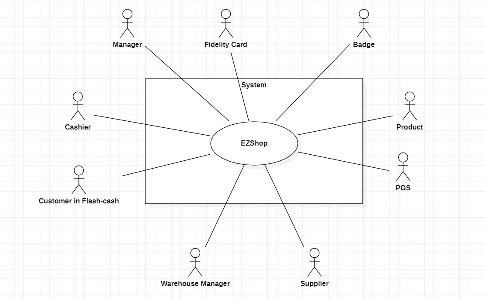
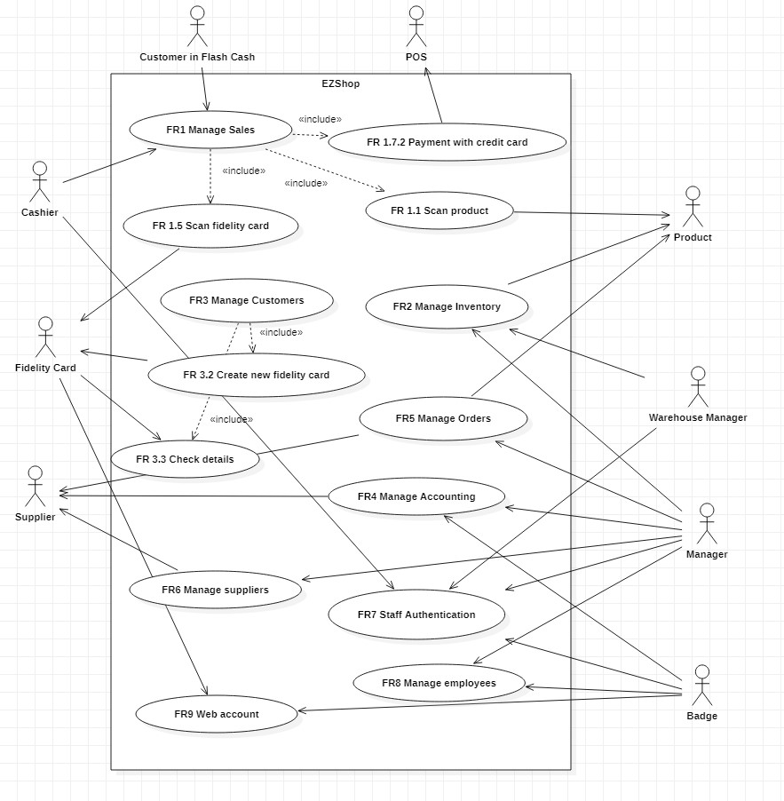
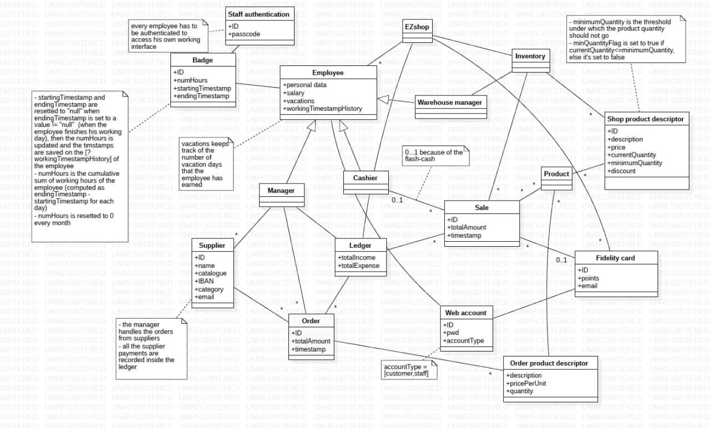
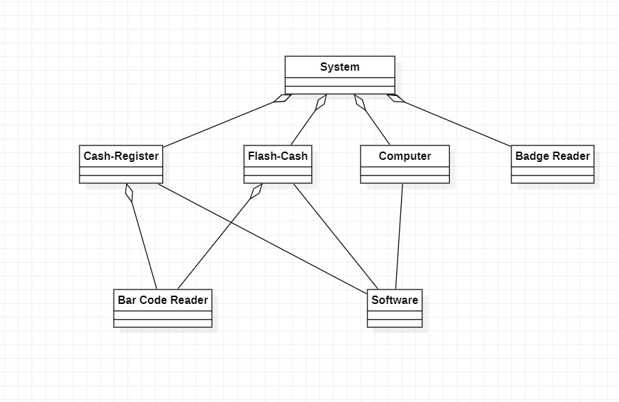
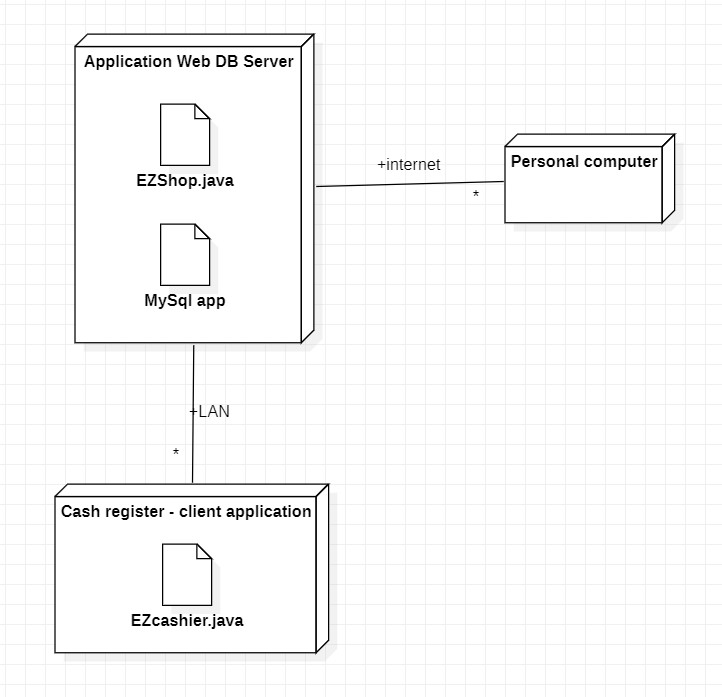

# Requirements Document 

Authors: Salem Mohamed Salem Metwaly Abouzaid, Patrizio de Girolamo, Giulia Medde, Carlo Vitale

Date: 21/04/2021

Version: 1st

# Contents

- [Essential description](#essential-description)
- [Stakeholders](#stakeholders)
- [Context Diagram and interfaces](#context-diagram-and-interfaces)
	+ [Context Diagram](#context-diagram)
	+ [Interfaces](#interfaces) 
- [Stories and personas](#stories-and-personas)
- [Functional and non functional requirements](#functional-and-non-functional-requirements)
	+ [Functional Requirements](#functional-requirements)
	+ [Non functional requirements](#non-functional-requirements)
- [Use case diagram and use cases](#use-case-diagram-and-use-cases)
	+ [Use case diagram](#use-case-diagram)
	+ [Use cases](#use-cases-and-relevant-scenarios)
    	+ [Relevant scenarios](#use-cases-and-relevant-scenarios)
- [Glossary](#glossary)
- [System design](#system-design)
- [Deployment diagram](#deployment-diagram)

# Essential description

Small shops require a simple application to support the owner or manager. A small shop (ex a food shop) occupies 50-200 square meters, sells 500-2000 different item types, has one or a few cash registers 
EZShop is a software application to:
* manage sales
* manage inventory
* manage customers
* support accounting

# Stakeholders

| Stakeholder name  | Description | 
| ----------------- |:-----------:|
| Manager | Manages employees, orders, suppliers, inventory and the ledger.| 
| Employee | Can be cashier, manager or warehouse manager. He owns a badge. |
| Cashier | Is an employee who manages the sales using the cash register. | 
| Warehouse manager | Is an employee who manages the inventory when products arrive from suppliers. |
| Customer | Can be a registered customer (memorized by the system through his fidelity card) or anonymous, he can use a flash-cash (self-checkout) |
| Fidelity card | Is attached to a customer's account and rapresents a registered customer. | 
| Badge | Is attached to an employee's account and rapresents an employee. |
| Product | Is a product of the shop, that can be sold, add to the inventory, or ordered from suppliers. | 
| Customer in flash-cash | Is a customer that is also the cashier for the sale, he uses the self-checkout. |
| Supplier | Is a company that supplies products. | 
| POS | Manages payment transactions. |

# Context Diagram and interfaces

## Context Diagram

## Interfaces

| Actor | Logical Interface | Physical Interface  |
| ------------- |:-------------:| -----:|
|  Manager  | GUI | Screen, keyboard|
| Cashier | GUI | Screen, keyboard on cash register|
| Warehouse manager | GUI | Screen, keyboard|
| Fidelity card | WebApp GUI | Screen,keyboard|
| Product | Bar code | Bar code reader | 
| Badge | Card code | Card reader |
| Customer in flash cash | GUI | Screen, keyboard on flash cash register| 
| POS | API https://stripe.com/docs/api?lang=php | Credit card reader|
| Supplier | API https://sendgrid.com/docs/api-reference/| Screen |
# Stories and personas

John is a customer that wants to purchase some products from the shop. He goes inside, takes products and goes to cash to pay them. He can use a self-checkout or he can goes to a cashier. He chooses the cash with the cashier. The cashier asks him if he has a fidelity card, but he hasn't. So the cashier asks to him if he wants to obtain one and he accepts. He compiles the piece of paper with all his personal data and the cashier inserts them on the system, creating a new fidelity card's account, and giving him his physical fidelity card. At this point che cashier scans the fidelity card with the bar code reader and starts to scan products using the bar code reader. At the end of the scansion the cashier tells him the total amount and asks to him if he wants pay through cash or credit card. He chooses the credit card, so provides it to the cashier, who puts it inside the POS. The transaction is successfull, so he can takes products and goes out. When he comes home he wants to know how much points he obtained, so he goes to the web site of the Ezshop, inserts his fidelity card's code and the password that he received via email and checks all the details of his account. 

Maria is a customer that wants to purchase some products using the flash-cash. She hasn't any fidelity card and she doesn't want to have one. She uses the screen, scans all the products with the bar code reader, inserts one product manually through the code because the bar code reader doesn't read it, and chooses to use 3 bags. She decides to pay with cash but unfortunately she hasn't enough. So the transaction failed and she can't buy the products. She pushes the button "cancel transaction" and she leaves the shop.

Angel is a new employee of the shop. He arrives to his new work place and goes to the manager, who creates his profile with all his personal data, including his role (warehouse manager), and gives him the badge. So he slides the new badge in the card reader and his working day starts. He uses his new credentials to have the access on the PC to register all the products that arrive from suppliers, updating inventory. At the end of his working day he slides the badge and comes back home. He wants to check his details as an employee, so he goes to Ezshop website and inserts his credentials to have the access of his profile. 

Jane is the manager of the shop. She comes to work, slides her badge, and inserts her credentials in the PC to have access to her working area. She checks if the new warehouse manager correctly updated the inventory and she notices that the quantity of five products is lower than the minimum quantity. One of these products is out of production for the registered supplier, so she looks for another one, registers him in the list of suppliers, and makes the orders for all the 5 products from their respective suppliers. By the click on the button "send order" an email is automatically sent to the supplier. At the end of her working day, before comes back home, she checks the ledger, to monitorize all the incomes and the expenses.

# Functional and non functional requirements

## Functional Requirements

|ID                 |  sub ID| sub sub ID| Description | 
|-------------|:---------------:|:--------------|:------|
|  **FR1**    || | **Manage sales** |
||1.1 || start scan and create list 
||1.2 || add to list 
||1.3 || update total amount 
||1.4 || remove from the list 
||1.5 || scan fidelity card  
||1.6 || end scan product  
||1.7 || apply discount 
||1.8 || update fidelity points 
||1.9 || update total amount
||1.10 || payment
|||1.10.1 | payment with cash
|||1.10.1.1 | insert amount
|||1.10.1.2 | give the change
|||1.10.2 | payment with credit card
|||1.10.2.1 | start payment with POS
|||1.10.2.2 | end payment with POS
||1.11 || end sale
|||1.11.1 |print receipt
|||1.11.2 | save the receipt for statistics
|||1.11.3 | save the receipt for the fidelity card
| **FR2**    ||| **Manage inventory**  | 
||2.1 ||manage products:
|||2.1.1 | add product
|||2.1.2 | change description
|||2.1.3 | change price
|||2.1.4 | change picture
|||2.1.5 | increase the current quantity in the shop
|||2.1.6 | decrease the current quantity in the shop
|||2.1.7 | define a minimum quantity ‘M’ (under which the item should not go)
||2.2 || search the product
|||2.2.1 | by ID
|||2.2.2 | by name
|||2.2.3 | by bar code
|  **FR3**     ||| **Manage customers** | 
||3.1 || create a new fidelity card | 
|||3.1.1 | provide personal data|
|||3.1.2 | create a new account | 
|  **FR4**     ||| **Manage accounting** | 
||4.1 || compute some statistics
|||4.1.1 | compute total revenue
|||4.1.2 |compute number of customers
|||4.1.3 |compute top sellers
|||4.1.4 | analytics
||4.2 || ledger
|||4.3.1 | employees’ salaries
|||4.3.2 | suppliers’ payments
|||4.3.3 | compute incomes 
|||4.3.4 | compute expenses 
|||4.3.5 | compute gross profit
|||4.3.6 | compute net profit
|  **FR5**     ||| **Manage orders** | 
||5.1 || create order
||5.2.1 || add list of products 
||5.2.2 || insert supplier 
||5.2.3 || confirm the order
||5.2.4 || send the order by API
|  **FR6**     ||| **Manage suppliers** | 
||6.1 || add supplier
||6.2 || remove supplier
||6.3 || modify supplier
||6.4 || payment
|  **FR7**     ||| **Staff authentication** | 
||7.1 || create new account
||7.2 || log in
||7.3 || log out
||7.4 || modify account
|  **FR8**    ||| **Manage employees** | 
||8.1 || manage badge system (in-out)
||| 8.1.1 |compute the number of hours enrolled
||| 8.1.2 | compute vacations
||8.2 || compute salary
| **FR9** ||| **WebAccount** |
||9.1 || login as customer
|||9.1.1 | check personal data 
|||9.1.2 | check products
|||9.1.3 | check fidelity points
|||9.1.4 | check discounts 
|||9.1.5 | check prizes
|||9.1.6 | check purchases
|||9.1.7 | credentials recovery
|||9.1.8 | edit personal data 
||9.2 || login as staff 
|||9.2.1 | check personal data 
|||9.2.2 | check salaries
|||9.2.3 | edit personal data 

## Non Functional Requirements

| ID        | Type (efficiency, reliability, ..)           | Description  | Refers to |
| ------------- |:-------------:| :-----:| -----:|
|  NFR1     |  EFFICIENCY | Performance of the application. |Any page of the application should not require more than 6 seconds. The application should be able to support 10 concurrent users.
|  NFR2     | USABILITY | The ease of use for a person that has never used it. | A customer that uses the flash cash spends only 1 minute to learn how it works. An employee that uses the application spends only 5 minutes to learn how it works. |
|  NFR3   | RELIABILITY | Necessary time to repair it. | In case of failure the time to repair should not be more than 2 hours. |
| NFR4 | PORTABILITY | On how much kind of system the application works. | The system should be portable to various operating enviroments | 
| NFR5 | AVALIABILITY | The time that the application is ON. | The in-store application has to be avaliable 6 days a week from 7am to 11 pm (according to the opening times of the shop). The online application has to be avaliable 24 hours a day, 7 days a week. | 
| NFR6 | SCALABILITY | How much of concurrent users the application supports. | The system should be able to scale up 10 concurrent users for the in-store application. The system should be able to scale up 500 concurrent users for the online application.| 
| NFR7 | SECURITY | What kind of protection the system guarantees. | Each person has to enter in the system using id/pass. According to the different roles each person has access to a different part of the application. The system never stores data not belonging to the account (es. credit card number). Personal data are protected ad GDPR requires. Safe transactions. | 
| NFR8 | MAINTANABILITY | The ease of apply changing. | Changes can easily implemented, wether for bug fixed or to add new functionalities. 

# Use case diagram and use cases

## Use case diagram

# Use cases and relevant scenarios

### Use case 1, UC1 (MANAGE SALES)
| Actors Involved        |  Cashier, Fidelity card, Payment gateway, Product |
| ------------- |:-------------:| 
|  Precondition     | product exists, customer exists, inventory exists, fidelity card exists, credit card exists|  
|  Post condition     | I.products[p].quantity_post < I.products[p].quantity_pre; Incomes_post > Incomes_pre |
|  Nominal Scenario     | A customer that has a fidelity card purchases some products using the credit card. |
|  Variants     | customer doesn't have the fidelity card, aborted transaction, customer pays with cash. |

##### Scenario 1.1 

| Scenario 1.1 | A customer that has a fidelity card purchases products with a credit card. | 
| ------------- |:-------------:| 
|  Precondition     | customer C has fidelity card FC, C pays with credit card CC and has enough money. |
|  Post condition     | the inventory I is updated, the receipt R is created and print, the total incomes is updated, FC points are updated  |
| Step#        | Description  |
|  1     | start sale |  
|  2     | scan fidelity card |
|  3     | scan product using the barcode reader |
|  4     | add product to list | 
|  5     | repeat #3, #4 for all products |
|  6	 | add bags |
|  7     | compute tot amount, applying eventual discounts |
|  8      | start transaction using POS API |
|  9      | transaction completed | 
|  10      | update inventory | 
|  11     | update FC.points | 
|  12     | print and save the receipt | 
|  13     | update income | 
|  14     | end sale |
##### Scenario 1.2
| Scenario 1.2 | A customer that doesn't have a fidelity card purchases products with a credit card. |
| ------------- |:-------------:| 
|  Precondition     | customer C doesn't have a fidelity card FC, C pays with credit card CC and has enough money. |
|  Post condition     | the inventory I is updated, the receipt R is created and print, the total incomes is updated  |
| Step#        | Description  |
|  1     | start sale |  
|  2     | scan a product using the barcode reader |  
|  3     | repeat #2,#3 for all the products |
|  4	 | add bags |
|  5     | compute tot income, applying eventual discounts |
|  6     | start transaction using POS API |
|  7     | transaction completed |
|  8     | update inventory |
|  9     | print and save the receipt |          
|  10     | update incomes |   
|  11    | end sale |   
##### Scenario 1.3
| Scenario 1.3 | A customer that has a fidelity card purchases products with cash. |
| ------------- |:-------------:| 
|  Precondition     | customer C has a fidelity card FC, C pays with cash and has enough money. |
|  Post condition     | the inventory I is updated, the receipt R is created and print, the total incomes is updated, FC is updated  |
| Step#        | Description  |
|  1     | start sale |  
|  2     | scan fidelity card |
|  3     | scan product using the barcode reader |
|  4     | add product to list | 
|  5     | repeat #3, #4 for all products |
|  6	 | add bags |
|  7     | compute tot amount, applying eventual discounts |
|  8      | payment with cash |
|  9      | compute change | 
|  10      | update inventory | 
|  11     | update FC.points | 
|  12     | print and save the receipt | 
|  13     | update income | 
|  14     | end sale |
##### Scenario 1.4
| Scenario 1.4 | A customer that doesn't have a fidelity card purchases products with cash. |
| ------------- |:-------------:| 
|  Precondition     | customer C doesn't have a fidelity card FC, C pays with cash and has enough money. |
|  Post condition     | the inventory I is updated, the receipt R is created and print, the total incomes is updated, FC is updated  |
| Step#        | Description  |
|  1     | start sale |  
|  2     | scan product using the barcode reader |
|  3     | add product to list | 
|  4     | repeat #3, #4 for all products |
|  5	 | add bags |
|  6     | compute tot amount, applying eventual discounts |
|  7      | payment with cash |
|  8      | compute change | 
|  9      | update inventory | 
|  10     | print and save the receipt | 
|  11     | update income | 
|  12     | end sale |
##### Scenario 1.5
| Scenario 1.5 | A customer tries to purchas products but he hasn't enough money.|
| ------------- |:-------------:| 
|  Precondition     | customer C hasn't enough money. |
|  Post condition     |  |
| Step#        | Description  |
|  1     | start sale |  
|  2     | scan product using the barcode reader |
|  3     | add product to list | 
|  4     | repeat #3, #4 for all products |
|  5	 | add bags |
|  6     | compute tot amount, applying eventual discounts |
|  7      | start transaction (both cash or credit card) |
|  8      | transaction failed | 
|  9      | delete list | 
|  10     | end sale | 

### Use case 2, UC2 (MANAGE INVENTORY)
| Actors Involved        | Warehouse manager, Manager |
| ------------- |:-------------:| 
|  Precondition     | inventory exists, product exists, I[p].quantity_pre >= M|  
|  Post condition     | inventory is updated, I[p].quantity is changed, I[p].quantity_pre <> I[p].quantity_post|
|  Nominal Scenario     | The inventory is changed, by the warehouse manager in case of the arrival of the products from suppliers. |
|  Variants     | The inventory is updated automatically during a sale. |

##### Scenario 2.1 
| Scenario 2.1 | After the arrival of the products from the supplier, the product's quantity increases.|
| ------------- |:-------------:| 
|  Precondition     | product P exists in the inventory I |
|  Post condition     | P.quantity_pre < P.quantity_post |
| Step#        | Description  |
|  1     | search P in I | 
|  2     | I[P].quantity += P.quantity |
|  3     | check minimumQuantity for I[P] |
|  4     | update I[P].minQuantityFlag to report if the quantity is higher |
|  5     | repeat #1, #2, #3, #4 for each product to be updated   | 

##### Scenario 2.2
| Scenario 2.2 | After a sale, the product's quantity decreases. |
| ------------- |:-------------:| 
|  Precondition     | product P exists in the inventory I |
|  Post condition     | P.quantity_pre > P.quantity_post |
| Step#        | Description  |
|  1     | search P in I | 
|  2     | I[P].quantity -= P.quantity |
|  3     | check minimumQuantity for I[P] |
|  4     | update I[p].minQuantityFlag to report if the quantity is higher |
|  5     | repeat #1, #2, #3, #4 for each product to be updated   |   

##### Scenario 2.3
| Scenario 2.3 | A product is added in the inventory. |
| ------------- |:-------------:| 
|  Precondition     | product P doesn't exist in the inventory I |
|  Post condition     | I[P] exists |
| Step#        | Description  |
|  1     | add P in I | 
|  2     | set P.minimumQuantity |
|  3     | I[P].quantity = P.quantity |
|  4     | update P.minQuantityFlag to report if the quantity is higher |
|  5     | repeat #1, #2, #3, #4 for each product to be added| 

##### Scenario 2.4
| Scenario 2.4 | A product is removed from inventory. |
| ------------- |:-------------:| 
|  Precondition     | product P exists in the inventory I |
|  Post condition     | I[p] doesn't exist anymore |
| Step#        | Description  |
|  1     | search P in I | 
|  2     | remove I[P] |
|  3     | repeat #1, #2 for each product to be removed | 
### Use case 3, UC3 (MANAGE CUSTOMERS)
| Actors Involved        |  Cashier, Fidelity card, Customer |
| ------------- |:-------------:| 
|  Precondition     | the cashier exists, a new fidelity card that isn't attached to any account exists |  
|  Post condition     | the account attached to the fidelity card can be used now |
|  Nominal Scenario     | A cashier creates a new account attached to a new fidelity card, attached to a customer |
|  Variants     |  |

##### Scenario 3.1 
| Scenario 3.1 | A cashier creates a new fidelity card. |
| ------------- |:-------------:| 
|  Precondition     | authenticated cashier AC has the fidelity card FC not attached to any account |
|  Post condition     | FC is attached to an account |
| Step#        | Description  |
|  1     | AC starts "new fidelity card" session | 
|  2     | AC inserts all the infos of C |
|  3     | AC lets the system create a random password for the C account |
|  4     | C account attached to FC is created |
|  5     | the system sends an email to the C email with his FC.ID and FC.password |
|  6     | AC gives the physical FC to C |

### Use case 4, UC4 (MANAGE ACCOUNTING)
| Actors Involved        |  Cashier, Fidelity card, Customer |
| ------------- |:-------------:| 
|  Precondition     | the ledger exists |  
|  Post condition     | incomes and expenses are updated |
|  Nominal Scenario     | every income and expense is recorded in the ledger  |
|  Variants     |  |

##### Scenario 4.1 
| Scenario 4.1 | After a sale, the income is registered in the ledger. |
| ------------- |:-------------:| 
|  Precondition     | ledger L exists, a sale S exists with the totalIncome I |
|  Post condition     | I is recorded inside L, L.totalIncome is updated |
| Step#        | Description  |
|  1     | income I is retrevied from P.totalAmount | 
|  2     | I is recorded inside L |
|  3     | I.totalIncome += I |

##### Scenario 4.2
| Scenario 4.2 | An expense is registered in the ledger. |
| ------------- |:-------------:| 
|  Precondition     | ledger L exists, an expense E exists (it may be a payment to suppliers or employee salaries) |
|  Post condition     | E is recorded inside L, I.totalExpense is updated |
| Step#        | Description  |
|  1     | E is recorded inside L | 
|  2     |  I.totalExpense += E |

### Use case 5, UC5 (MANAGE ORDERS)
| Actors Involved        |  Manager, Supplier |
| ------------- |:-------------:| 
|  Precondition     | a manager exists, a supplier exists, the expense E doesn't exist yet |  
|  Post condition     |  expense E is recorded, order O is recorded |
|  Nominal Scenario     | the manager creates a new order, of some products, from a supplier  |
|  Variants     |  |

##### Scenario 5.1 
| Scenario 5.1 | A manager creates a new order from a supplier. |
| ------------- |:-------------:| 
|  Precondition     | authenticated manager M exists, a supplier S exists, the expense E dowsn't exist yet |
|  Post condition     | expense E is recorded, order O is recorded |
| Step#        | Description  |
|  1     | M creates a new order instance from S | 
|  2     | M adds product+quantity inside O |
|  3     | repeat #2 for every product |
|  4     | E is calculated as sum(O.forEach((product) => product.price*product.quantity)) |
|  5     | O is sent to S via  email | 
|  6     | E is sent to S.IBAN | 
|  7     | E and O are recorded | 
|  8     | end order | 

##### Scenario 5.2 
| Scenario 5.2 | An order is sent to the supplier by the API. |
| ------------- |:-------------:| 
|  Precondition     | order O exists, supplier S exists, manager M exists |
|  Post condition     | O is sent to S |
| Step#        | Description  |
|  1     | M pushes button "send order" | 
|  2     | an email with the order is sent by sendgridAPI to S.email |
|  3     | the system displays "The order has been sent" |

### Use case 6, UC6 (MANAGE SUPPLIERS)
| Actors Involved        |  Manager, Supplier |
| ------------- |:-------------:| 
|  Precondition     | a manager exists |  
|  Post condition     |  |
|  Nominal Scenario     | the manager manage the list of suppliers  |
|  Variants     | the suppliers exists and has to be removed, the supplier doesn't exists and has to be created |

##### Scenario 6.1 
| Scenario 6.1 | A supplier is added by the manager. |
| ------------- |:-------------:| 
|  Precondition     | authenticated manager M exists, a supplier S doesn't exist inside the list of suppliers SL |
|  Post condition     | S exists in SL |
| Step#        | Description  |
|  1     | M starts new "add supplier" instance | 
|  2     | M inserts name, catalogue, IBAN of S (S.ID is autoincremental) |
|  3     | on M confirm, S is added to SL |

##### Scenario 6.2
| Scenario 6.2 | A supplier is removed by the manager. |
| ------------- |:-------------:| 
|  Precondition     | authenticated manager M exists, a supplier S exists inside the list of suppliers SL |
|  Post condition     | S doesn't exist anymore |
| Step#        | Description  |
|  1     | M starts new "remove supplier" instance | 
|  2     | M selects the supplier to be removed |
|  3     | on M confirm, S is removed from SL |

### Use case 7, UC7 (STAFF AUTHENTICATION)
| Actors Involved        |  Manager, Supplier |
| ------------- |:-------------:| 
|  Precondition     | the new employee doesn't have his badge nor account |  
|  Post condition     | the badge is attached to the employee so he can authenticate himself |
|  Nominal Scenario     | the employee is created and can authenticate himself in the system |
|  Variants     | the employee had to be removed |

##### Scenario 7.1 
| Scenario 7.1 | The manager creates a new employee's account attached to the badge. |
| ------------- |:-------------:| 
|  Precondition     | manager M has the physical badge B that isn't attached yet to any account |
|  Post condition     | B is attached to the employee E, his account is created and E can authenticate himself |
| Step#        | Description  |
|  1     | M starts new "new employee" instance | 
|  2     | M inserts all the infos of E, including his role |
|  3     | M lets the system to create a random passcode (6 numbers) for the E's account |
|  4     | E account attached to B is created |
|  5     | the system sends an email to the E.email with his B.ID and B.passcode |
|  6     | M gives the physical badge B to E |

##### Scenario 7.2
| Scenario 7.2 | The manager removes an employee. |
| ------------- |:-------------:| 
|  Precondition     | employee E exists |
|  Post condition     | E doesn't exist anymore |
| Step#        | Description  |
|  1     | M starts new "remove employee" instance | 
|  2     | M selects E to be removed |
|  3     | on M confirm, E is removed |

##### Scenario 7.3
| Scenario 7.3 | An employee does the login to his working area. |
| ------------- |:-------------:| 
|  Precondition     | employee E exists and wants to have access to his working area |
|  Post condition     | E obtains access to his working area |
| Step#        | Description  |
|  1     | "login" page is already displayed by default | 
|  2     | E inserts the B.ID and the passcode |
|  3     | the system gives to E his working area according to his role |

##### Scenario 7.4
| Scenario 7.4 | An employee does the logout from his working area. |
| ------------- |:-------------:| 
|  Precondition     | employee E exists and is logged in |
|  Post condition     | E is logged out |
| Step#        | Description  |
|  1     | E selects "logout" | 
|  2     | E is logged out |

##### Scenario 7.5
| Scenario 7.5 | An employee inserts wrong credentials during the login. |
| ------------- |:-------------:| 
|  Precondition     | employee E exists and wants to have access to his working area |
|  Post condition     | E doesn't obtain access to his working area |
| Step#        | Description  |
|  1     | "login" page is already displayed by default | 
|  2     | E inserts the B.ID and the passcode |
|  3     | the system displays "ID or passcode is wrong" | 
|  4     | repeat #1, #2 for maximum 10 times |
|  5     | login attempt is blocked, the manager must intervene |

### Use case 8, UC8 (MANAGE EMPLOYEES)
| Actors Involved        |  Manager, Supplier |
| ------------- |:-------------:| 
|  Precondition     | the employee hasn't start his working day yet |  
|  Post condition     | the employee starts his working day |
|  Nominal Scenario     | the employee goes to work and his working hours are recorded |
|  Variants     | the employee leaves the work place |

##### Scenario 8.1 
| Scenario 8.1 | An eployee starts his working day sliding the badge. |
| ------------- |:-------------:| 
|  Precondition     | badge B attached to employee E exists, B.isWorking flag is set to false |
|  Post condition     | B.isWorking flag is set to true, B.startingTimestamp is set |
| Step#        | Description  |
|  1     | E slides the badge in the card reader| 
|  2     | B is retrieved |
|  3     | B.startingTimestamp is recorded |
|  4     | B.isWorking is set to true |

##### Scenario 8.2
| Scenario 8.2 | An employees ends his working day sliding the badge. |
| ------------- |:-------------:| 
|  Precondition     | badge B attached to employee E exists, B.isWorking flag is set to true|
|  Post condition     | B.isWorking flag is set to false, B.numHours is updated, timestamps are recorded inside E.workingTimestampHistory |
| Step#        | Description  |
|  1     | E slides the badge in the card reader| 
|  2     | B is retrieved |
|  3     | B.endingTimestamp is recorded |
|  4     | B.isWorking is set to false |
|  5     |numHours += (endingTimestamp – startingTimestamp) |
|  6     | E.workingTimestampHistory is updated |
|  7     | timestamps are resetted to "null" |

### Use case 9, UC9 (WEB APPLICATION)
| Actors Involved        |  Manager, Supplier |
| ------------- |:-------------:| 
|  Precondition     | the user has credentials |  
|  Post condition     | the user is logged in|
|  Nominal Scenario     | a user (customer or employee) wants to have access to his profile in the web application of the shop |
|  Variants     | the user wants to log out, the user doesn't have right credentials |

##### Scenario 9.1 
| Scenario 9.1 | A customer does the login in the web site of the shop. |
| ------------- |:-------------:| 
|  Precondition     | a customer C with fidelity card FC exists, C isn't logged in |
|  Post condition     | C is logged in the website |
| Step#        | Description  |
|  1     | C selects "login as customer" | 
|  2     | C inserts the FC.ID and the password |
|  3     | C is logged in |

##### Scenario 9.2
| Scenario 9.2 | An employee does the login in the web site of the shop. |
| ------------- |:-------------:| 
|  Precondition     | an employee E with a badge B exists, E isn't logged in  |
|  Post condition     | E is logged in |
| Step#        | Description  |
|  1     | E selects "login as staff" | 
|  2     | E inserts the B.ID and the passcode|
|  3     | E is logged in |

##### Scenario 9.3
| Scenario 9.3 | The user does the logout. |
| ------------- |:-------------:| 
|  Precondition     | logged user U(employee or customer) exists and is logged in  |
|  Post condition     | U is logged out |
| Step#        | Description  |
|  1     | E selects "logout" | 
|  2     | E is logged out |

##### Scenario 9.4
| Scenario 9.4 | The user inserts wrong credentials. |
| ------------- |:-------------:| 
|  Precondition     | employee E or customer C exists and wants to have access to his working area |
|  Post condition     | E/C doesn't obtain access to his working area |
| Step#        | Description  |
|  1     | E selects "login ad staff" or C selects "login as customer" | 
|  2     | E/C inserts respective ID and the passcode/password |
|  3     | the system displays "ID or pass is wrong" | 
|  4     | repeat #1, #2 for maximum 5 times |
|  5     | login attempt for this IP is blocked for 30 minutes |

##### Scenario 9.5
| Scenario 9.5 | The customer browses the site. |
| ------------- |:-------------:| 
|  Precondition     | customer C has access to his account |
|  Post condition     | C browses the site |
| Step#        | Description  |
|  1     | C checks prizes | 
|  2     | C checks offers |
|  3     | C checks products | 
|  4     | C edits his personal data|
|  5     | C checks his personal data|

##### Scenario 9.6
| Scenario 9.6 | An employee browses the site. |
| ------------- |:-------------:| 
|  Precondition     | employee E has access to his account |
|  Post condition     | E browses the site |
| Step#        | Description  |
|  1     | E checks his personal statistics | 
|  2     | E edits his personal data|
|  3     | E checks his personal data|

##### Scenario 9.7
| Scenario 9.7 | A user retrieves his credentials. |
| ------------- |:-------------:| 
|  Precondition     | employee/customer user U exists |
|  Post condition     | U gets an email with his credentials |
| Step#        | Description  |
|  1     | U clicks on "retrieve credentials" | 
|  2     | U inserts U.email |
|  3     | U gets an email with his credentials|

# Glossary

# System Design

# Deployment Diagram 

