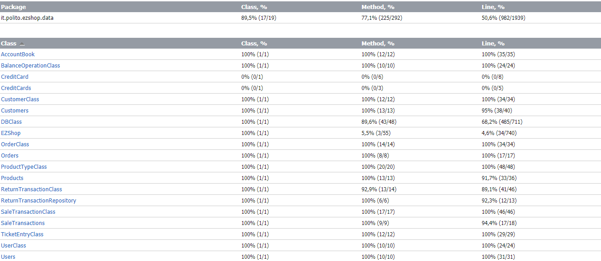

# Unit Testing Documentation

Authors:Salem Mohamed Salem Metwaly Abouzaid, Patrizio de Girolamo, Giulia Medde, Carlo Vitale

Date: 19/05/2021

Version: 1.0

# Contents

- [Black Box Unit Tests](#black-box-unit-tests)

- [White Box Unit Tests](#white-box-unit-tests)

# Black Box Unit Tests

    <Define here criteria, predicates and the combination of predicates for each function of each class.
    Define test cases to cover all equivalence classes and boundary conditions.
    In the table, report the description of the black box test case and (traceability) the correspondence with the JUnit test case writing the 
    class and method name that contains the test case>
    <JUnit test classes must be in src/test/java/it/polito/ezshop   You find here, and you can use,  class TestEzShops.java that is executed  
    to start tests
    >

### **Class *EZShop* - method *validCreditCard***

**Criteria for method *validCreditCard*:**
	
 - Type of the characters
 - Credit Card validation according to the Luhn Algorithm
 - Length of Credit Card

**Predicates for method *validCreditCard*:**

| Criteria | Predicate |
| -------- | --------- |
|  Type of the characters  |     ALL digits       |
|        "                 |   NOT ALL digits     |
|     Validity     |     valid    |
|       "          |     NULL or Invalid     |
|  Length of Credit Card  |  >= 0 && <= 12  |
|         "               |  >=13 && <= 19  |
|         "               |       > 19      |

**Boundaries**:

| Criteria | Boundary values |
| -------- | --------------- |
|    Validity      |   null, invalid, valid   |
|     type of characters     |    All digits, NOT All digits             |
|   Length of Credit Card    |  0, 13, 19, maxint    |

**Combination of predicates**:

| Length  | Type of the characters | validation according to the Luhn Algorithm | Valid / Invalid | Description of the test case | JUnit test case |
|-------  |------|----------|-----------------|-------|-------|
|[0, 13)  |   *  |   *      |    Invalid      |validCreditCard("123") -> false|TestEZShop_Validator_BB.TestCCFalse|
|(20, maxint)| * |   *      |    Invalid      |validCreditCard("98765432101234567890") -> false |TestEZShop_Validator_BB.TestCCFalse|
|*   | Not all digits | *   |    Invalid      |validCreditCard("12123921ab21215") -> false |TestEZShop_Validator_BB.TestCCFalse|
|*   |  All digits  |Invalid|    Invalid      | validCreditCard("9876543210123") -> false,    validCreditCard(null) -> false  | TestEZShop_Validator_BB.TestCCTrue,   TestEZShop_Validator_BB.TestCCFalse  |
|[13,19]|All digits|Valid|Valid| validCreditCard("4551188765219900") -> true| TestEZShop_Validator.TestCCTrue |

 ### **Class *EZShop* - method *barcodeValidator***

**Criteria for method *barcodeValidator*:**
	
 - Length of barCode
 - Type of barCode characters
 - barCode validation according to the protocol

**Predicates for method *barcodeValidator*:**

| Criteria | Predicate |
| -------- | --------- |
|  Type of the characters  |     ALL digits       |
|        "                 |   NOT ALL digits     |
|     Validity     |     valid    |
|       "          |     NULL or Invalid     |
|  Length of barCode  |  >= 0 && < 12  |
|         "               |  >=12 && <= 14  |
|         "               |       > 15      |

**Boundaries**:

| Criteria | Boundary values |
| -------- | --------------- |
|    Validity      |   null, invalid, valid   |
|     type of characters     |    All digits, NOT All digits             |
|   Length of barCode    |  0, 12, 14, maxint    |

**Combination of predicates**:

| Length  | Type of barCode characters | Validation according to the protocol | Valid / Invalid | Description of the test case | JUnit test case |
|---------|-----|----------|-----------------|------------------------------|-----------------|
|[0, 12)  |*    |     *    |     Invalid     |barcodeValidator("122") -> false |TestEZShop_Validator_BB.TestBCFalse|
|(14, maxint)| * | *       |     Invalid     |barcodeValidator("123456789012345678") -> false |TestEZShop_Validator_BB.TestBCFalse|
|* | Not all digits | *    |     Invalid     |barcodeValidator("123abc") -> false  |TestEZShop_Validator_BB.TestBCFalse|
|*| *           |Invalid   |     Invalid     |barcodeValidator("123456789015") -> false  |TestEZShop_Validator_BB.TestBCTrue |
|[12,14]  |All digits|Valid|     Valid      |barcodeValidator("723951367038") -> true  |TestEZShop_Validator_BB.TestBCTrue |

 ### **Class *CustomerClass* - method *attachLoyaltyCard***

**Criteria for method *attachLoyaltyCard*:**
	
 - Length of card code
 - Type of characters

**Predicates for method *attachLoyaltyCard*:**

| Criteria | Predicate |
| -------- | --------- |
|  Type of the characters  |     ALL digits       |
|       "          |     NOT ALL digits       |
|     Validity     |     valid    |
|       "          |     NULL or Invalid     |
|  Length of card code  |  ==10  |
|         "               |  !=10  |

**Boundaries**:

| Criteria | Boundary values |
| -------- | --------------- |
|    Validity      |   null, invalid, valid   |
|     type of characters     |    All digits             |
|   Length of barCode    |  0, 10, maxint    |

**Combination of predicates**:

| Length  | Type of barCode characters | Valid / Invalid | Description of the test case | JUnit test case |
|---------|-----|-----------------|------------------------------|-----------------|
|10  | All digits   |     Valid     |attachLoyaltyCard("0123456789") -> true |TestEZShop_Validator_BB.validLoyaltyCard|
|!=10| *       |     Invalid     |barcodeValidator("das3456dqe012ad5678") -> false |TestEZShop_Validator_BB.invalidLoyaltyCard|
|* | Not all digits |     Invalid     |barcodeValidator("a12345678h") -> false  |TestEZShop_Validator_BB.invalidLoyaltyCard|

# White Box Unit Tests

### Test cases definition
    
    <JUnit test classes must be in src/test/java/it/polito/ezshop>
    <Report here all the created JUnit test cases, and the units/classes under test >
    <For traceability write the class and method name that contains the test case>

| Unit name | JUnit test case |
|--|--|
|Classes: OrderClass, Orders, DBClass | jUnitTests.TestEZShop_Orders_WB|
|Classes: ProductTypeClass, Products, DBClass | jUnitTests.TestEZShop_Products_WB|
|Classes: UserClass, Users, DBClass | jUnitTests.TestEZShop_Users_WB|
|Classes: BalanceOperationClass, AccountBook, DBClass | jUnitTests.TestEZShop_AccountBook_WB|
|Classes: SaleTransactionClass, SaleTransactions, DBClass | jUnitTests.TestEZShop_SaleTransactions_WB|
|Classes: ReturnTransactionClass, ReturnTransactions, DBClass | jUnitTests.TestEZShop_ReturnTransactions_WB|
|Classes: CustomerClass, Customers, DBClass | jUnitTests.TestEZShop_Customers_WB|

### Code coverage report

    <Add here the screenshot report of the statement and branch coverage obtained using
    the Eclemma tool. >

 

### Loop coverage analysis

    <Identify significant loops in the units and reports the test cases
    developed to cover zero, one or multiple iterations >

|Unit name | Loop rows | Number of iterations | JUnit test case |
|---|---|---|---|
|||||
|||||
||||||

